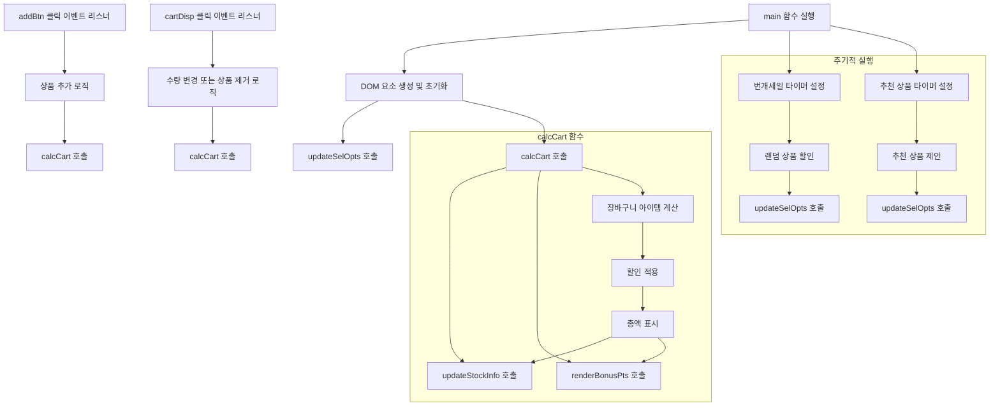
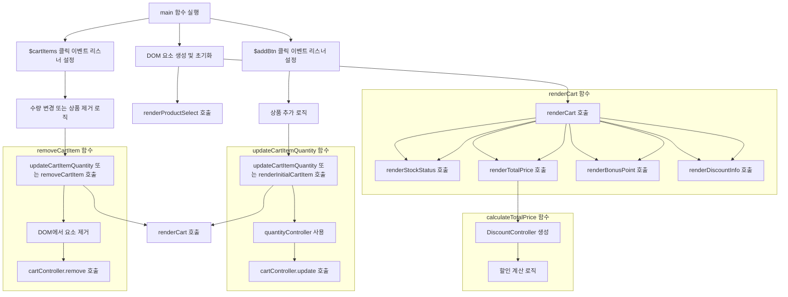
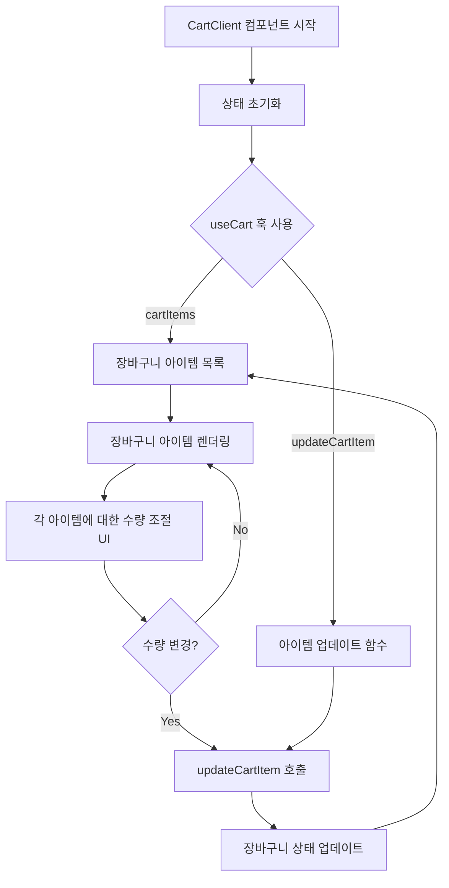

# 근거

## 개선 포인트

- 일단 `mermaid`로 큰 로직들의 흐름 파악
- `mermaid`를 통해 파악한 순서로 일단 로직을 확인
- 루트부터 개선할 수 있는 부분을 파악하고 개선
- 그리고 각 파트에서는 하나의 역할을 최대한 수행할 수 있도록 분리

### 공통 개선사항

1. `var`의 산재 - 변수 재할당의 위험이 있어 모두 let으로 전환
   1. 외부에서 접근하는 경우를 최대한 줄임
2. 흩어져있는 친구들끼리 최대한 묶어보기 (=동일한 역할)
3. 데이터로 관리하는 부분과 렌더링을 담당하는 부분을 분리하고자 `class`기반의 데이터 컨트롤러와 `renderer`를 분리

### 과제 개선사항

1. `element` 생성 부분을 한곳으로 몰았다.
   1. 생성된 `element`의 네이밍이 한눈에 어떤 역할을 하는 지 파악이 어려운 부분이 있어 무분별한 줄임말을 개선
2. class를 통해 복잡한 로직들을 담당하는 부분을 분리
   1. 할인 계산
   2. 재고 관리
   3. 장바구니 관리

## 과제 개선 포인트

1. 상품을 추가할 수 없는 상황인데도 포인트는 쌓임
2. 상품의 부족/품절 텍스트 표기는 중첩으로
3. 추가된 상품의 +/- 버튼으로는 재고 관련 로직이 정상동작하나 추가 버튼으로 재고관리를 할 시 정상동작을 하지 않음
4. 번개세일, 추가할인... 중복으로 계속 가격이 할인되도 되는것인가...

## 테스트코드 개선 포인트

1. 할인률은 조건을 만족했을 때만 노출해야하는데 미충족 시 체크하는 과정이 없음.
2. 재고부족 텍스트 또한 조건을 만족했을 때만 노출되어야 하는데 그렇지 않았을 때 필터링이 없음
3. 요일 세일에 관한?

### 할인율 적용 플로우

1. `totalAmt`, `itemCnt`, `subTot` 0으로 설정
2. 개별 상품에 대한 정가의 합을 `subTot`에 저장
3. 개별 상품에 대한 할인가의 합을 `totalAmt`에 저장
4. `itemCnt` 즉 장바구니의 총 개수가 30개가 넘으면 `bulk`(대량구매) 로직으로 이동
5. `bulk`의 할인율과 기존의 할인율을 비교해서 할인율이 더 큰걸 최종 계산
6. 화요일 할인의 경우 중복할인으로 최종 `totalAmt`의 10% 적용
7. 할인율은 가장 큰것 표기 / 할인가 = 개별 상품 할인가를 기본으로 `bulk`와 화요일 할인은 중복

## Flow

- 클로드를 통해서 흐름 파악

`main` 함수가 실행되어 초기 설정을 수행합니다.

- `main` 함수가 실행되어 초기 설정을 수행합니다.
- DOM 요소들이 생성되고 초기화됩니다.
- `updateSelOpts`와 `calcCart` 함수가 호출되어 초기 상태를 설정합니다.
- 번개세일과 추천 상품에 대한 타이머가 설정됩니다.
- 사용자 상호작용에 따라 상품 추가, 수량 변경, 제거 등의 이벤트가 발생합니다.
- 각 상호작용 후 `calcCart` 함수가 호출되어 장바구니 상태를 업데이트합니다.
- 주기적으로 번개세일과 추천 상품 로직이 실행됩니다.

### 리팩토링 후 Flow

1. `main` 함수가 실행되어 초기 설정을 수행합니다.
2. DOM 요소들이 생성되고 초기화됩니다.
3. `renderProductSelect`와 `renderCart` 함수가 호출되어 초기 상태를 설정합니다.
4. 사용자 상호작용을 위한 이벤트 리스너가 설정됩니다.
5. 사용자가 상품을 추가하거나 장바구니 아이템을 조작할 때 해당 로직이 실행됩니다.
6. 각 상호작용 후 `renderCart` 함수가 호출되어 장바구니 상태를 업데이트합니다.
7. `calculateTotalPrice` 함수는 할인을 계산하고 총 가격을 결정합니다.
8. `updateCartItemQuantity`와 `removeCartItem` 함수는 장바구니 아이템을 조작합니다.

### 심화과제 Flow

이 그래프는 다음과 같은 CartClient 컴포넌트의 주요 흐름을 나타냅니다:

1. 컴포넌트가 시작되고 상태가 초기화됩니다.
2. useCart 훅을 사용하여 cartItems와 updateCartItem 함수를 가져옵니다.
3. cartItems를 사용하여 장바구니 아이템 목록을 렌더링합니다.
4. 각 아이템에 대해 수량 조절 UI를 제공합니다.
5. 사용자가 수량을 변경하면 updateCartItem 함수가 호출됩니다.
6. 장바구니 상태가 업데이트되고, 변경된 상태로 다시 렌더링됩니다.
